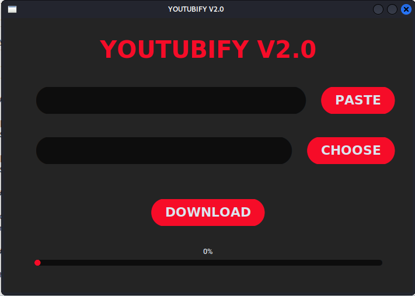
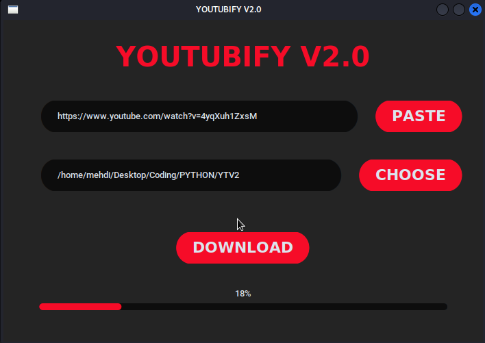

## YOUTUBIFY V2.0 - YouTube Video Downloader

YOUTUBIFY V2.0 is a simple Python application that allows you to download YouTube videos with ease. This application is built using the `tkinter` library for the graphical user interface and the `pytube` library for handling YouTube video downloads.

### Features

- Download YouTube videos in the highest resolution available.
- Copy and paste video URLs directly from the clipboard.
- Choose a custom destination directory for downloaded videos.
- Monitor download progress with a graphical progress bar.

### Getting Started

To use the YOUTUBIFY V2.0 application, follow these steps:

1. Clone this repository to your local machine.
2. Install the required Python libraries:
```
pip install tkinter pytube clipboard
```
3. Run the `youtubify.py` script:
```
python main.py
```
4. The application window will open. Paste the YouTube video URL and choose a destination directory for the downloaded video.
5. Click the "DOWNLOAD" button to initiate the download.

## Screenshots


*Screenshot 1: YOUTUBIFY V2.0 main interface.*


*Screenshot 2: Download in progress with the progress bar.*

## Contributions

Contributions to YOUTUBIFY V2.0 are welcome! If you find any issues or have suggestions for improvements, feel free to open an issue or submit a pull request.

## License

This project is licensed under the [MIT License](LICENSE).

---

Developed by Sir Mehdi
[GitHub](https://github.com/kourdroid)

